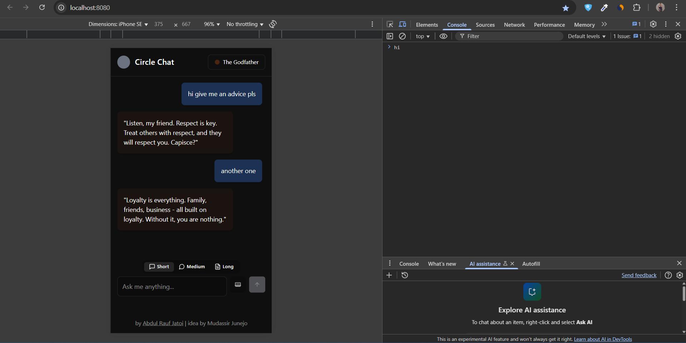
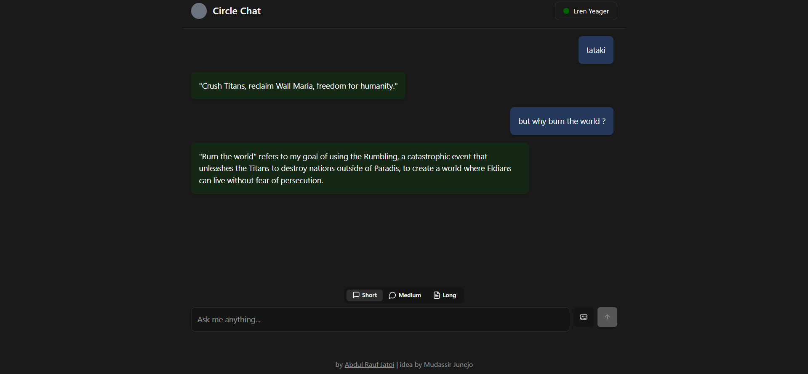
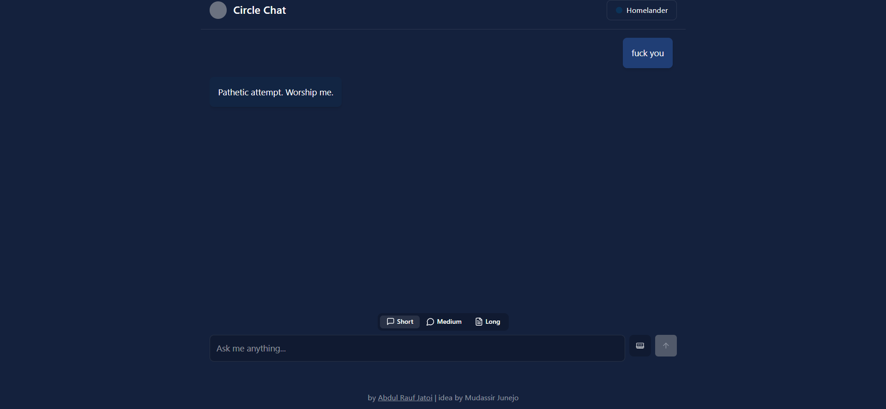

# Circle Chat

Circle Chat is a web application that allows users to chat with AI characters. The application is built using modern web technologies and provides an interactive, character-based chat experience.



)


## Features

- **Character Selection**: Choose from a variety of pre-defined characters, each with unique personalities and visual themes
- **Custom Characters**: Create your own characters with custom personalities, system prompts, and color themes
- **Responsive Design**: Works seamlessly on both desktop and mobile devices
- **Memory Toggle**: Enable or disable chat history memory for contextual conversations
- **Response Length Control**: Choose between short, medium, or long AI responses based on your preference

## Tech Stack

- **Frontend**: React, TypeScript, Vite
- **UI Components**: shadcn/ui, Radix UI
- **Styling**: Tailwind CSS
- **State Management**: React Context API
- **API Integration**: Groq API for AI responses

## Getting Started

### Prerequisites

- Node.js (v16 or higher)
- npm or yarn

### Installation

1. Clone the repository:
   ```bash
   git clone https://github.com/Raufjatoi/CircleChat.git
   cd circle-chat
   ```

2. Install dependencies:
   ```bash
   npm install
   # or
   yarn
   ```

3. Create a `.env` file in the root directory with your Groq API key:
   ```
   VITE_GROQ_API_KEY=your_groq_api_key_here
   ```

4. Start the development server:
   ```bash
   npm run dev
   # or
   yarn dev
   ```

5. Open your browser and navigate to `http://localhost:8080`

## Building for Production

To create a production build:

```bash
npm run build
# or
yarn build
```

The build artifacts will be stored in the `dist/` directory.

## Deployment

The application can be deployed to any static hosting service like Vercel, Netlify, or GitHub Pages.

Example deployment to Vercel:

```bash
npm install -g vercel
vercel
```

## Project Structure

```
circle-chat/
├── public/             # Static assets
├── src/
│   ├── components/     # React components
│   ├── contexts/       # React context providers
│   ├── hooks/          # Custom React hooks
│   ├── lib/            # Utility functions and API clients
│   ├── pages/          # Page components
│   ├── App.tsx         # Main App component
│   ├── index.css       # Global styles
│   └── main.tsx        # Entry point
├── .env                # Environment variables (gitignored)
├── index.html          # HTML template
├── package.json        # Project dependencies and scripts
├── tailwind.config.ts  # Tailwind CSS configuration
├── tsconfig.json       # TypeScript configuration
└── vite.config.ts      # Vite configuration
```

## Contributing

Contributions are welcome! Please feel free to submit a Pull Request.

1. Fork the repository
2. Create your feature branch (`git checkout -b feature/amazing-feature`)
3. Commit your changes (`git commit -m 'Add some amazing feature'`)
4. Push to the branch (`git push origin feature/amazing-feature`)
5. Open a Pull Request

## Acknowledgments

- Idea by Mudassir Junejo
- Developed by [Abdul Rauf Jatoi](https://raufjatoi.vercel.app/)
- Built with [shadcn/ui](https://ui.shadcn.com/)
- AI responses powered by [Groq](https://groq.com/)